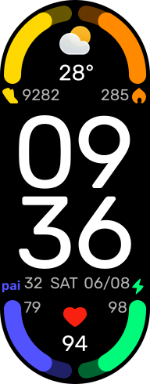

# Classic Watchface



I really liked the default watchface on Xiaomi Smart Band 7, but I missed the digital clock.

## Features

- Editable
- Jump to the app by clicking on corresponding widget

## Documentation

I found useful the official [Zepp OS Dev documentation](https://docs.zepp.com/).

## Build Instructions

### 1. Install [Zeus CLI](https://docs.zepp.com/docs/guides/tools/cli/)

```
npm i @zeppos/zeus-cli -g
```

### 2. Install packages

```
npm install
```

### 3. Build

```
zeus build
```

> If you get an error in PowerShell, try using cmd.

### 4. Prepare for sync

```
python extract_bin.py
```

### 5. Sync with band

Use [Mi Band 7 Watch Faces](https://play.google.com/store/apps/details?id=asn.ark.miband7) or similar app and select `.bin` file and `icon.png`.


> You can directly copy `dist/<app_id>` directory to `storage/emulated/0/Android/data/com.xiaomi.hm.health/files/watch_skin_local/` on your phone and install using Zepp Life, although it is only possible on versions earlier than 6.3.3.

## Credits

Used font: [Rubik](https://github.com/googlefonts/rubik)

## Notes

- Date is currently only in DD/MM format
